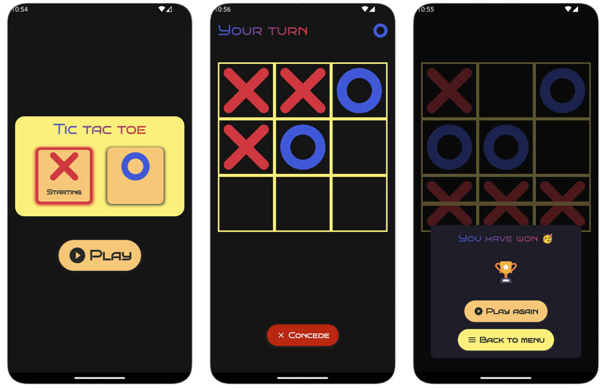

# Tic tac toe for Android
A second part of a school project focused on observing the capabilities of neural networks to play a simple game of tic tac toe withouth the use of reinforced learning. The app is a simple implementation of a tic tac toe game on a 3x3 playing field for Android. The exported tflite model is used for decision making of the oponent. 

The practical implementation of creating the oponent model is available [here](https://github.com/michalmusil/tic-tac-toe-mlp).

## In-app screenshots

